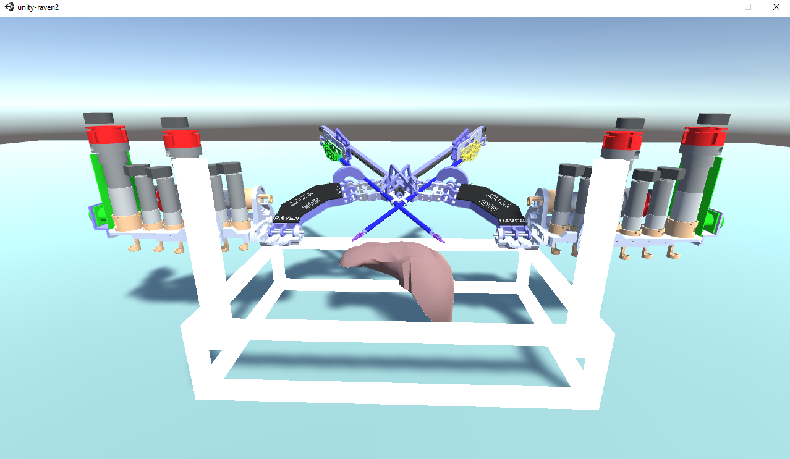

Raven 2 Robot with V-REP and Unity3D
=======================================

    

## Requirements

## Instructions

### For Users

- V-REP
- Docker (To easily run ROS)

### For Contributors

The following instructions are for building and running the project from scratch.
- V-REP
- Unity: To build the visualization you must have Unity3D installed (Currently Windows and Mac are officially supported. For use in Linux install the experimentation software as described in [here](./docs/unity-linux-install.md))
- Docker (To easily run ROS)

## Why V-REP

V-REP is used in this project for most of the simulation calculations (inverse kinematics, path planning,
 sensors, etc.). V-REP is:
- Fully featured Robotics simulation software
- Cross platform support: Windows, Linux, MacOS (key difference from Gazebo)
- Standalone: ROS is not required
- Good interoperability: ROS Interface, RemoteAPI, Support for Python, MATLAB, C++ and others

## Why Unity3D

Unity3D is chosen for the visualization of the robotic simulations (instead of V-REP) for the following reasons:
- Superior graphics and photorealism
- Multi platform support: Windows, Linux, MacOS as well as WebGL
- More flexibility in terms of physics engines. This is especially useful for medical simulations where it is 
  important to visualize and manipulate non-rigid objects. (TODO: Integration with SOFA framework)
- Support for VR & AR: This is very important for the field of surgery robotics!